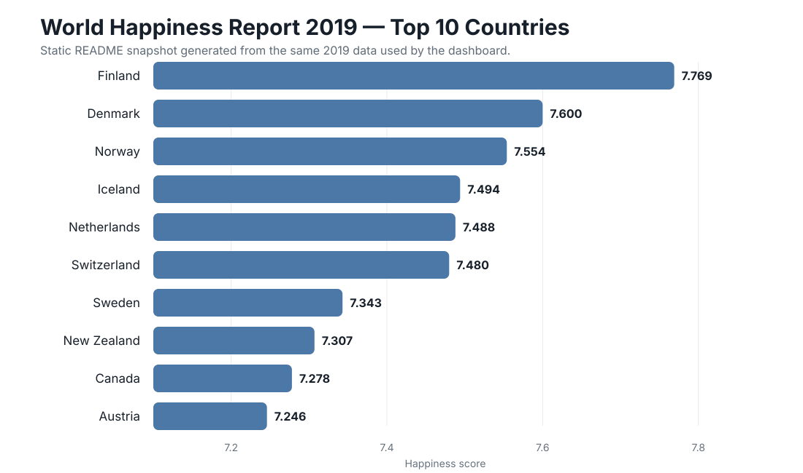
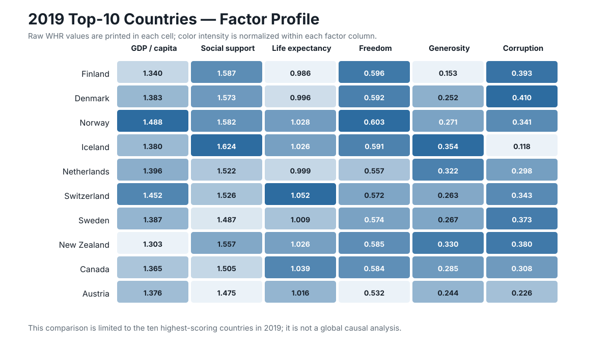

# World Happiness Report — Animated Global Dashboard

**Global happiness trends → country ranking shifts → regional patterns → factor relationships → out-of-time model evaluation**

A ready-to-explore Streamlit analytics dashboard built around the **World Happiness Report 2015–2019** data.

The project is designed so a visitor can open the application and immediately explore the analysis. There is **no CSV upload step**: the app loads a pinned public historical dataset, normalizes the changing annual schemas, and renders the analytical outputs automatically.

---

## Project question

> **How did national happiness scores and rankings change from 2015 through 2019, which socioeconomic factors move most closely with happiness, and how well do relationships learned from earlier years generalize to 2019?**

The project combines animated exploratory analysis with an interpretable regression baseline. The goal is not to claim causal drivers of happiness, but to make the observed relationships, geographic patterns, and model limitations easy to inspect.

---

## Visual snapshot

The interactive dashboard contains the full animated analysis. The static visuals below are committed README snapshots built from the same pinned World Happiness data so a GitHub reviewer can see real project evidence without running the app first.



**What this shows:** Finland leads the 2019 ranking in the project dataset with a happiness score of **7.769**, followed by Denmark and Norway. The top ten are tightly grouped, which is why the dashboard keeps both the underlying score and the relative rank visible rather than treating rank alone as the analytical result.



**What this shows:** the top-ranked countries do not share one identical factor profile. The cells display the raw 2019 World Happiness factor values, while color intensity is normalized **within each factor column** only to make differences easier to scan. This is a focused comparison of the 2019 top ten—not evidence that any one factor causes higher happiness globally.

These README figures are static summaries. The application itself extends the analysis across all available countries and all five years through animated maps, ranking changes, regional trends, factor scatterplots, correlations, and the 2019 holdout model.

---

## Analytical workflow

```text
Pinned World Happiness historical data
        ↓
Filter to 2015–2019
        ↓
Normalize year-specific column names
        ↓
Recover historical region labels where needed
        ↓
Animated country and regional analysis
        ↓
Factor association analysis
        ↓
Train regression on 2015–2018
        ↓
Evaluate on unseen 2019 observations
```

The source is pinned to a specific Git commit so the dashboard does not silently change when an upstream repository is updated.

---

# Dashboard outputs

## 1. Animated global happiness map

The first major output is a Plotly choropleth with a **Play** control that moves through 2015, 2016, 2017, 2018, and 2019.

Each country is colored by its happiness score, while the hover layer exposes the country name, score, and within-year rank.

### What this tells us

The animation makes broad geographic patterns easier to see than five separate static maps. It also makes it possible to follow how a country's position changes over time rather than treating a single annual ranking as permanent.

The map is descriptive. Similar colors across nearby countries do not establish that geography itself caused similar happiness outcomes.

---

## 2. Top-country ranking race

The dashboard creates an animated horizontal ranking chart for the highest-scoring countries in each year. The number of countries displayed can be changed from the sidebar.

### What this tells us

The ranking race highlights movement at the top of the distribution and makes year-to-year changes easier to follow.

A rank is **relative**, however. A country can move up or down because its own score changed, because other countries changed, or both. The ranking therefore needs to be read together with the underlying happiness score.

---

## 3. Regional snapshot

For the selected year, the dashboard groups countries by region and calculates the mean happiness score for each region.

### What this tells us

Regional averages provide a useful high-level comparison, but they can hide substantial country-level variation. A strong regional mean should not be interpreted as evidence that every country in that region has the same experience.

The country map and regional view are therefore intended to complement each other.

---

## 4. Regional trend analysis

The app also calculates average happiness by region across the full 2015–2019 period and displays those values as a time-series chart.

### What this tells us

This view separates a one-year snapshot from a multi-year pattern. A region that appears high or low in one year may have a different trajectory when several years are considered together.

The chart is most useful for direction and relative movement; it should not be treated as a causal evaluation of regional policy.

---

## 5. Animated factor relationships

A selector lets the reviewer examine the relationship between happiness score and:

- GDP per capita
- social support
- life expectancy
- freedom
- generosity
- perceptions of corruption

For each factor, the app creates an animated country-level scatterplot across 2015–2019.

### What this tells us

The scatterplots reveal whether countries with higher values on a factor also tend to report higher happiness scores, and whether that pattern looks stable across years.

These are **associations, not causal effects**. A positive relationship between GDP per capita and happiness, for example, does not prove that changing GDP alone would produce the observed difference in national happiness.

---

## 6. Factor correlation summary

The dashboard computes Pearson correlations between happiness score and the normalized analytical factors across the historical data and visualizes them in a horizontal bar chart.

### What this tells us

Correlation provides a compact descriptive screening view: it helps identify which variables move most closely with happiness in this dataset.

It does not control for confounding, interactions, country-specific effects, or changes in measurement across years. The correlation chart should therefore be treated as an exploratory summary rather than a policy-effect estimate.

---

# Holdout modeling

## 7. Can earlier years explain 2019 happiness scores?

The modeling section deliberately avoids evaluating the regression on the same observations used to fit it.

```text
Training period: 2015–2018
Holdout period: 2019
```

### Model features

- GDP per capita
- social support
- life expectancy
- freedom
- perceptions of corruption

The model is a transparent `LinearRegression` baseline from scikit-learn.

### Outputs shown in the dashboard

- **2019 holdout R²**
- **2019 holdout RMSE**
- **2019 holdout MAE**
- actual-vs-predicted 2019 scatterplot
- fitted coefficient chart

The metric values are calculated by the application at runtime from the normalized pinned dataset rather than being manually typed into this README.

### What this tells us

Using 2019 as an out-of-time holdout gives a more meaningful test than scoring the model on the same rows used for training. The displayed errors show how closely relationships estimated from 2015–2018 carry forward to a later year.

The coefficient chart is useful for interpretation, but the coefficients remain **descriptive model associations**. They should not be presented as causal contributions to national happiness.

---

# Data engineering

One of the less visible but important parts of the project is handling the changing World Happiness Report schemas across annual releases.

The application:

1. loads a pinned combined historical dataset;
2. restricts the analysis to 2015–2019;
3. converts year-specific versions of the same variables into normalized columns;
4. recovers a country's historical region when later records omit the region field;
5. calculates within-year rank from the normalized happiness score;
6. caches the cleaned dataset for responsive dashboard interaction.

Examples of normalized analytical fields include:

```text
Happiness_Score
GDP_per_Capita
Social_Support
Life_Expectancy
Freedom
Corruption
Generosity
```

### Why this matters

Without explicit normalization, a multi-year dashboard could accidentally compare different column definitions or drop later-year observations simply because the source headers changed. Keeping this logic visible in `app.py` makes the analysis reproducible and reviewable.

---

# Interactive controls

The Streamlit sidebar lets the reviewer change:

- snapshot year
- included regions
- number of countries in the ranking race

The animated Plotly charts also include their own **Play** controls.

The dashboard recalculates the relevant filtered views instead of relying on static screenshots.

---

# Tech stack

| Layer | Technology |
|---|---|
| Application | Streamlit |
| Data processing | pandas, NumPy |
| Interactive visualization | Plotly Express |
| Modeling | scikit-learn LinearRegression |
| Model evaluation | R², RMSE, MAE |
| Source period | World Happiness Report 2015–2019 |

---

# Run locally

```bash
git clone https://github.com/Boatengs/World-Happiness-Analysis.git
cd World-Happiness-Analysis

python -m venv .venv
source .venv/bin/activate        # Windows: .venv\Scripts\activate
pip install -r requirements.txt

streamlit run app.py
```

The dashboard loads its historical source automatically when the application starts.

---

# Repository structure

```text
.
├── app.py                  # animated dashboard + analytical workflow
├── figures/                # code-derived README visuals
├── README.md               # project overview and output interpretation
├── PROJECT_WALKTHROUGH.md  # deeper reviewer-facing analytical walkthrough
└── requirements.txt        # Python dependencies
```

For a section-by-section explanation of the analytical outputs, see [`PROJECT_WALKTHROUGH.md`](PROJECT_WALKTHROUGH.md).

---

# Key analytical cautions

- Correlation does not establish causation.
- Regression coefficients are not policy-effect estimates.
- Annual World Happiness Report schemas changed and require normalization.
- Some later-year records require region labels to be recovered from historical entries.
- Country naming differences can affect geographic rendering for a small number of locations.
- The linear regression is an interpretable baseline, not a claim that national happiness is fully explained by five variables.
- Country rankings are relative and should always be read alongside the underlying score.

---

# Reviewer path

1. Start with the README visuals for a quick evidence-first snapshot.
2. Run `streamlit run app.py`.
3. Press **Play** on the global happiness map.
4. Watch the country ranking race across 2015–2019.
5. Compare regional snapshots with the regional trend chart.
6. Switch between the socioeconomic factors in the animated scatterplot.
7. Review the factor correlation chart as an exploratory association summary.
8. Inspect the 2019 holdout R², RMSE, MAE, and actual-vs-predicted chart.
9. Read [`PROJECT_WALKTHROUGH.md`](PROJECT_WALKTHROUGH.md) for the interpretation and limitations behind each output.

---

## Documentation standard

This project follows the same documentation approach used across the broader GitHub portfolio: important analytical outputs are paired with plain-language interpretation, code comments explain analytical intent rather than obvious syntax, and limitations are documented rather than hidden.
